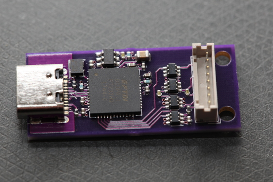

# JTAG_SWD



## JTAG

Hirose DF3A-6P-2DS header

## Adapter Cables

###

Hirose DF3-6EP-2C 6 pin inline header

TC2030-MCP
TC2030-MCP-NL

## Pinout

|Pin |JTAG | Serial Wire | AVR |
|----|-----|-------------|-----|
| 1  | VCC | VCC         | VCC |
| 2  | TCK | SWCLK       | SCK |
| 3  | GND | GND         | GND |
| 4  | TDO | SWDIO       | MISO |
| 5  | NC  | jumper to 6 | NC |
| 6  | NC  | jumper to 5 | NC |
| 7  | TDI | SWDIO       | MOSI |
| 8  | TMS | NC          | RST |

## OpenOCD config for ECP5-12

```
interface ftdi
ftdi_channel 0
ftdi_vid_pid 0x0403 0x6014
ftdi_layout_init 0x0058 0x00fb
ftdi_layout_signal nTRST -data 0x0010
ftdi_layout_signal nSRST -oe 0x0020
adapter_khz 10000

telnet_port 4444
gdb_port 3333
transport select jtag
reset_config none

jtag newtap lfe5 tap -expected-id 0x21111043 -irlen 8 -irmask 0xFF -ircapture 0x5
init
scan_chain
svf -tap lfe5.tap -quiet -progress build/display_fpga.svf
shutdown
```

## OpenOCD config for XC7A15T
```
interface ftdi
ftdi_channel 0
ftdi_vid_pid 0x0403 0x6014
ftdi_layout_init 0x0058 0x00fb
ftdi_layout_signal nTRST -data 0x0010
ftdi_layout_signal nSRST -oe 0x0020
telnet_port 4444
gdb_port 3333
transport select jtag
reset_config none
jtag newtap artix7 tap -irlen 6 -ignore-version -expected-id 0x0362E093
pld device virtex2 artix7.tap
adapter_khz 10000
adapter_nsrst_delay 200
init
pld load 0 top.bit
virtex2 read_stat 0
shutdown
```

## OpenOCD for SWD STM32F4

swd.cfg
```
source [find openocd.cfg]
flash info 0
flash write_image erase digital.elf
reset run
exit
```

openocd.cfg
```
interface ftdi
transport select swd
ftdi_channel 0
ftdi_vid_pid 0x0403 0x6014
ftdi_layout_init 0x0058 0x00fb
ftdi_layout_signal SWD_EN -data 0x0200
adapter_khz 1000
telnet_port 4444
gdb_port 3333
reset_config none
source [find target/stm32f4x.cfg]
init
reset halt
sleep 100
```

## AVRDude

```
avrdude -c c232hm -P USB -p m32u4 -v -b 500000
```

Higher baud rates failed.